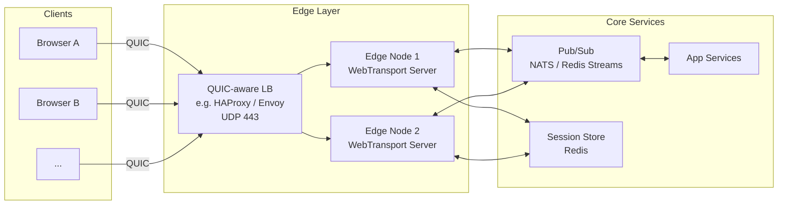
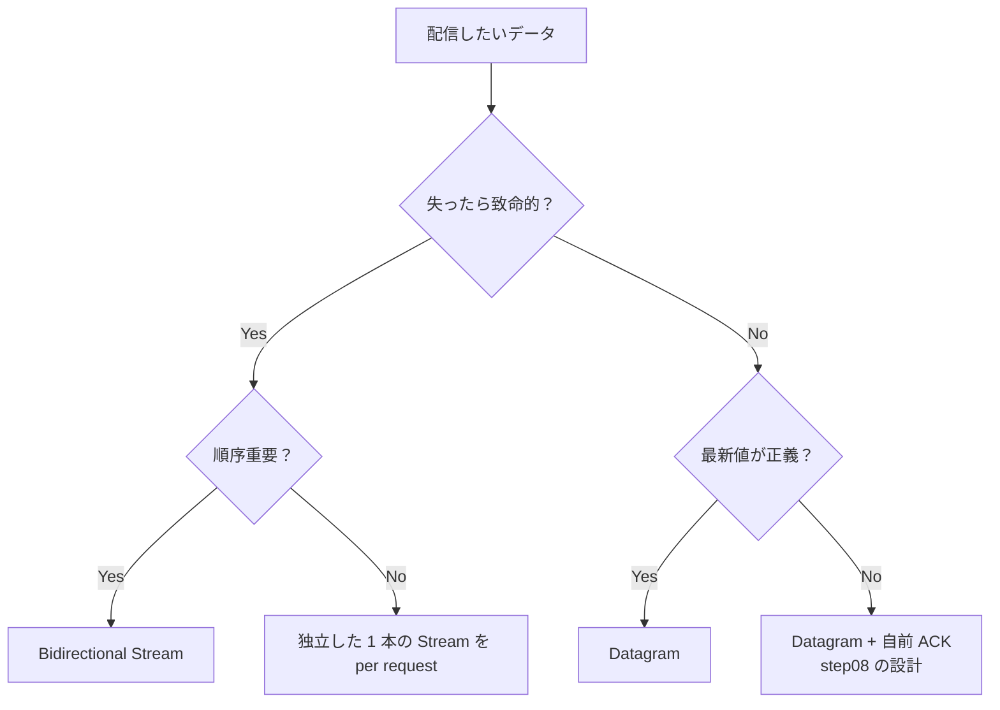
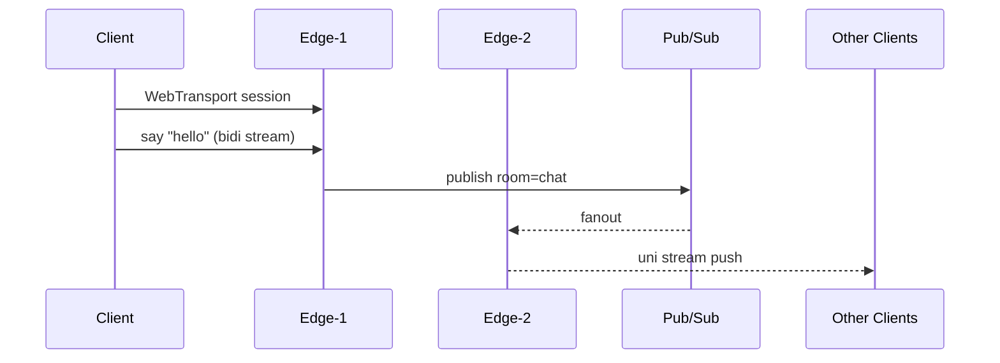

# Step 10 — アーキテクチャ設計

## 🎯 ゴール

- リアルタイム基盤として WebTransport を**本番に載せる** ときの構成を描ける
- Stream / Datagram / 多重化 / 信頼性の選択を、全体設計の文脈で語れる
- Node.js で学んだ構造を **Rust (`wtransport` crate)** に移すロードマップを持つ

## 全体像

ポイント:

- **Edge Layer** は WebTransport の I/O だけを担当。**業務ロジックは持たない**。
- **Pub/Sub** でノードまたぎの fanout を実現。クライアント接続は 1 ノードに張り付く (スティッキー) ので、他ノードのイベントは Pub/Sub 経由で回収して配る。
- **Session Store** (Redis) でセッション→ユーザー→ルームの索引を保持し、ノード障害時の再接続で状態を再構築する。

## Stream / Datagram の使い分け (再掲)

## Scale-out 設計

- クライアントは**常に 1 ノードへスティッキー**。L4 LB で `connection_id` ベースの一貫性を持たせる (HAProxy 2.6+ の QUIC connection-id hashing 等)。
- 送信は**自分が繋がっている Edge** のみ、配信は Pub/Sub 経由で**全 Edge** に届く。
- Edge は完全ステートレスに近づき、**水平スケール可能**。

## Rust 移行ロードマップ

本リポジトリの `shared/protocol/` と `step06/protocol/`, `step08/protocol/` は **pure JS で状態機械のみ** を書いてあります。これらは Rust に 1:1 で書き直せる粒度です。

`rust-sketch/` にビルド可能ではないテンプレート `Cargo.toml.example` を置いてあります。手順:

1. `cargo new wtransport-edge`
2. `wtransport` crate を追加 (`tokio` ランタイム)
3. Node 版の `shared/server/bootstrap.js` と同等の起動処理を main.rs に書く
4. `framing.js` / `reliable.js` のロジックをそのまま Rust に写経 (テストも残す)
5. Node 版との**差分は I/O 層のみ**になるよう設計する

## 学びの総括

- **WebSocket との最大の違い**: Stream / Datagram / 多重化を明示的に使い分けられる
- **設計の型**: 制御 stream 1 本 + イベント用 Datagram + broadcast 用 unidirectional stream
- **スケールの鍵**: 状態を Edge に持たせず、Pub/Sub で散らす
- **本番への橋**: Node で素早く検証し、ホットパスを Rust で置き換える

おつかれさまでした 🎉
